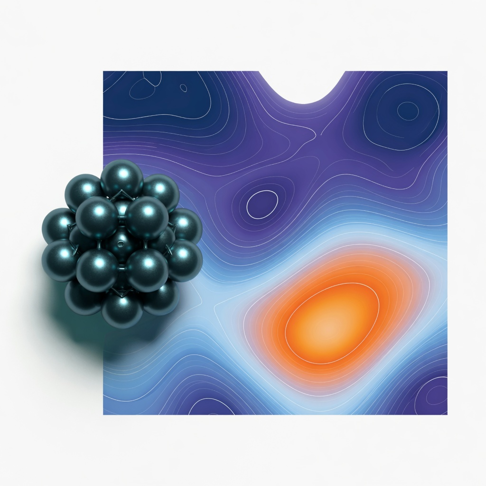

# landfold

Sigmoid-distance nonlinear embedding of high-dimensional molecular
data. MIT.

The transfer function and stress follow Ceriotti, Tribello and
Parrinello, *PNAS* **2011**,
[10.1073/pnas.1108486108](https://doi.org/10.1073/pnas.1108486108).
Each published kernel cites its paper in rustdoc.



## CLI

```
landfold embed -D 30 -d 2 --fun-hd 6,8,8 --fun-ld 6,2,8 --steps 50 < hd.dat
landfold project -D 30 -d 2 --high-file lm.hd --low-file lm.ld < frames.dat
landfold landmarks -D 30 -n 200 < hd.dat
landfold dist -D 30 < hd.dat
landfold fes --input ld.dat --svg fes.svg --csv fes.csv
```

`--stoch` switches the embedder from the standard full-pair
Polak-Ribiere CG to randomised pair mini-batches.

## License

MIT. See `CITATION.cff` for the papers to cite with the method.
